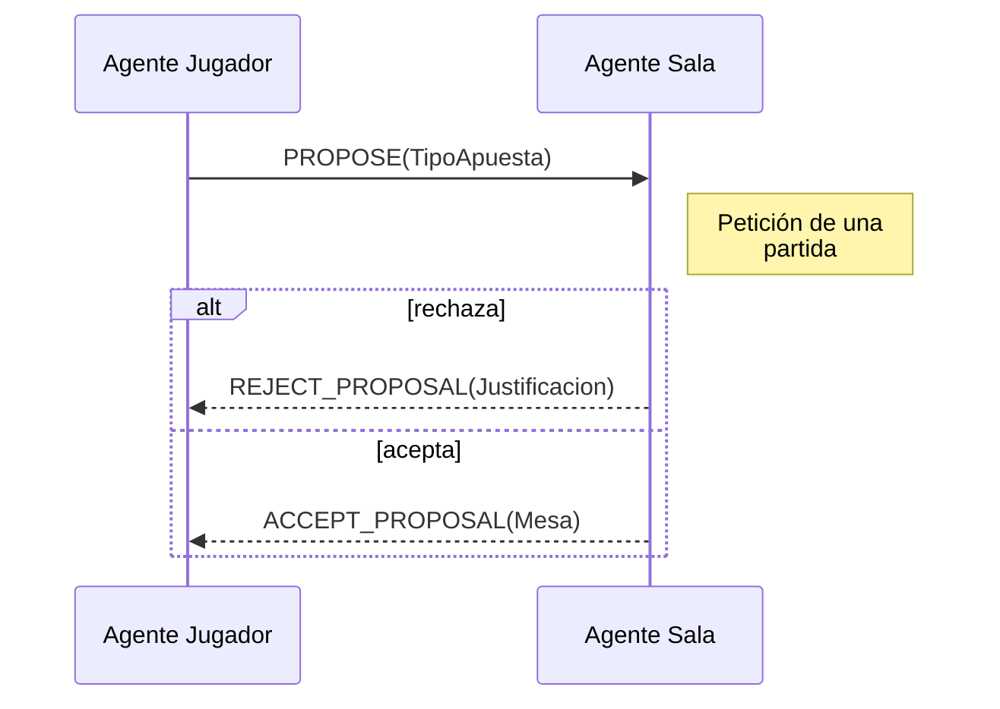
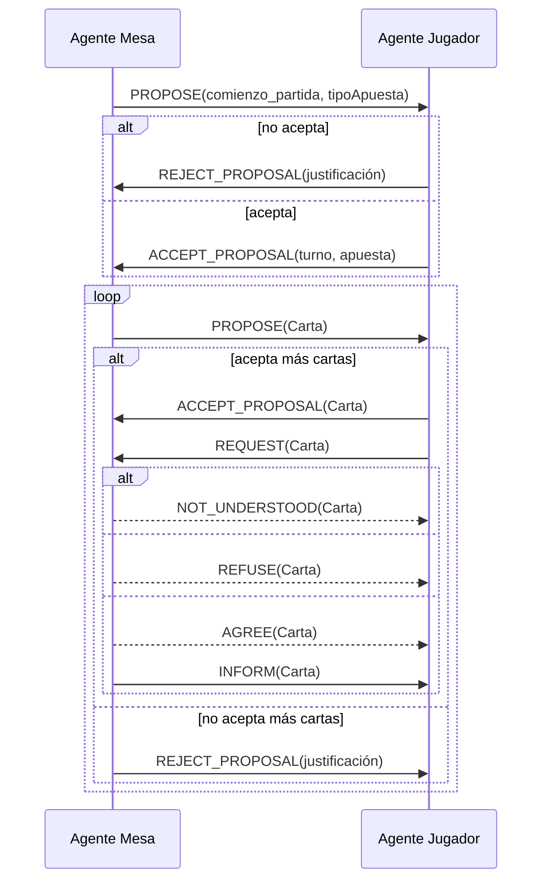
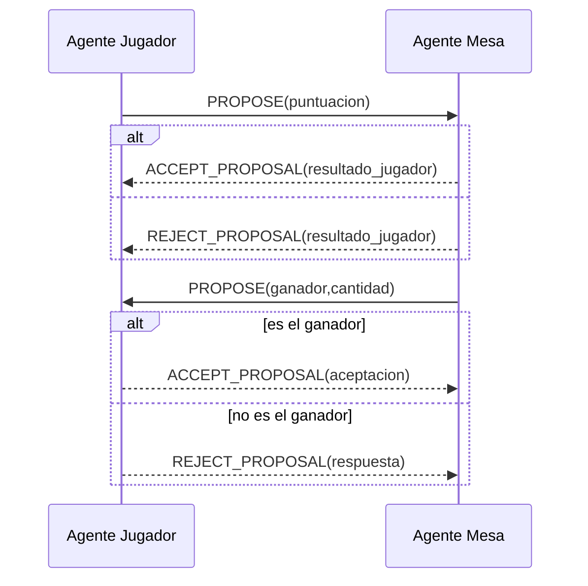
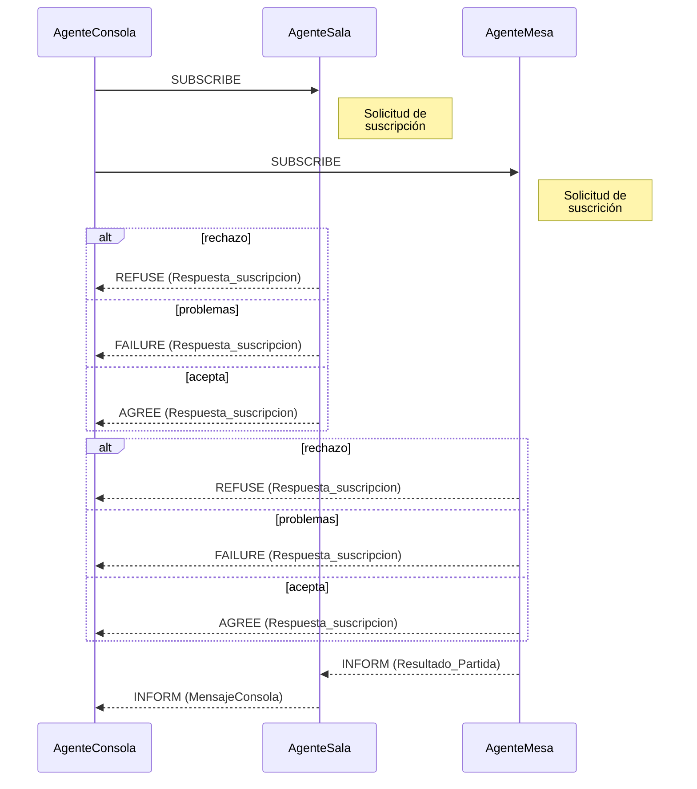
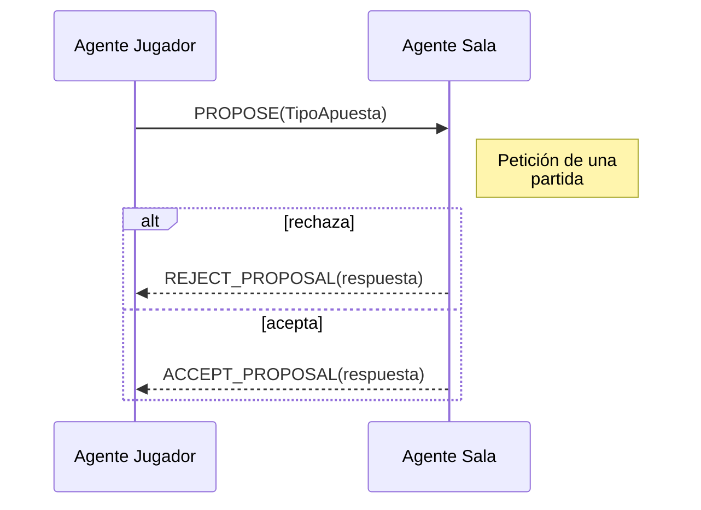
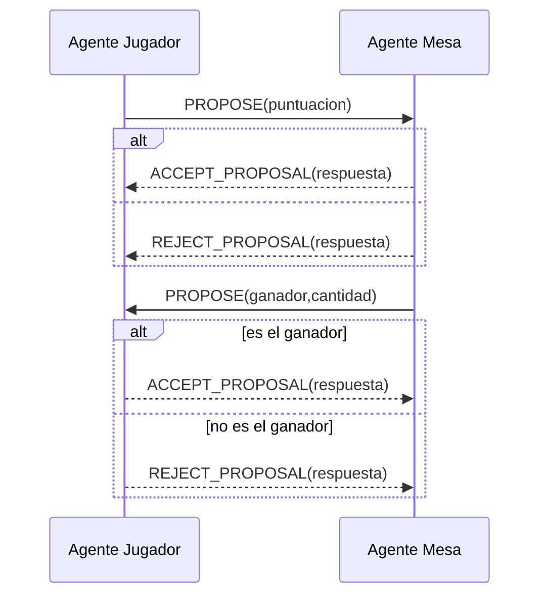
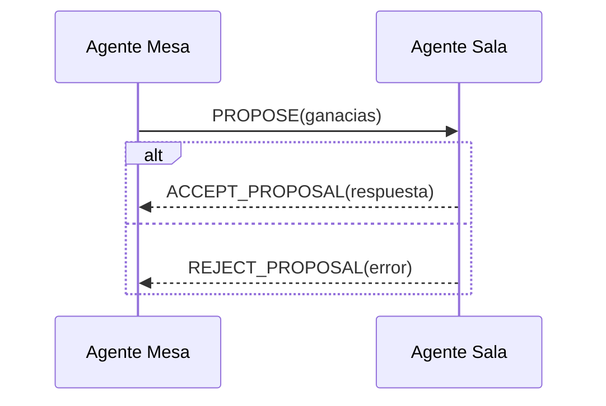

# Análisis de la ontología - Juego *Siete y media*
**_Francisco José Vico López (fjvl0015)_**
## Explicación del juego
Las siete y media es un juego de cartas muy simple, que se basa en la acumulación de puntos hasta llegar o quedarse lo más cerca posible de 7'5. 
Las cartas valen tanto como su valor numérico, excepto las figuras que valen medio punto cada una.
Gana el jugador de la mesa que más cerca esté de 7'5 puntos
## Análisis
Por definición, una ontología debe responder a las siguientes cuestiones:
### 1. ¿Cómo diferenciar a los agentes especializados?
Usaremos el elemento del Vocabulario TipoAgente para definirlos, que serán:
-```CONSOLA```: Se encarga de mostrar mensajes de información y depuración por una ventana emergente asociada a cada agente
-```SALA```: Es el encargado de recibir los jugadores y repartirlos a la mesa en la que jugarán su partida. Además gestiona el saldo del "casino"
-```MESA```: Es el encargado de presentar y desarrollar la partida, incluyendo el informar del desarrollo y desenlace de esta
-```JUGADOR```: Un participante en una (o varias) partidas de Siete y media

### 2. ¿Cómo proponer a los distintos jugadores que participen en un juego?
Esta comunicación es llevada acabo por los AgentesJugador, que tras encontrar a un AgenteSala gracias a su suscripción en las páginas amarillas, le piden participar en una partida de la siguiente forma:

Los elementos de ontología que se incluyen en esta comunicación son:
- ```TipoApuesta```: El tipo de apuesta que el AgenteJugador quiere realizar
	- ```SIMPLE```: El jugador apuesta una cantidad normal
	- ```DOBLE```: El jugador apuesta el doble de lo normal, para expertos
- ```Justificacion```: La justificación de la acción tomada por el agente, en este caso, para el rechazo
	- ```NO_PRESUPUESTO```: la banca no dispone de efectivo para aceptar más jugadores
	- ```MESAS_COMPLETAS```: ya está jugando el número máximo de jugadores posible
	- ```NO_ENTENDIBLE```: no se entendió el mensaje de solicitud
- ```Mesa```: La mesa asignada
 A la hora de iniciar un juego es necesaria la aceptación del AgenteMesa por parte del AgenteJugador, mediante la comunicación que se explica a continuación e incluye el desarrollo del turno
### 3. ¿Cómo completar un turno de una partida? ¿Cómo completar la partida?
Se lleva a cabo la comunicación de inicio de un juego, que deriva en el desarrollo de un turno

En ella toman parte los siguientes elementos de vocabulario:
- ```ComienzoPartida```: Solicitud de comienzo de partida
- ```TipoApuesta```: El tipo de apuesta que el AgenteJugador quiere realizar
	- ```SIMPLE```: El jugador apuesta una cantidad normal
	- ```DOBLE```: El jugador apuesta el doble de lo normal, para
- ```Justificacion```: La justificación de la acción tomada por el agente, en este caso, para el rechazo
	- ```NO_PRESUPUESTO```: la banca no dispone de efectivo para aceptar más jugadores
	- ```MESAS_COMPLETAS```: ya está jugando el número máximo de jugadores posible
	- ```NO_ENTENDIBLE```: no se entendió el mensaje de solicitud
- ```Apuesta```: La cantidad que el jugador desea apostar
- ```CARTA```: La carta entregada, de valores:
	- ```1```
	- ```2```
	- ```3```
	- ```...```
	- ```8```
	- ```9```
	- ```0'5```


### 4. ¿Cómo debe completarse un juego? ¿Cómo obtener el resultado del juego propuesto?
Para completar el juego se hace un recuento de las puntuaciones de los distintos jugadores, y se les comunica el resultado

Los elementos de ontología que componen la comunicación son los siguientes:
- ```Puntuacion```: La puntuación que el jugador ha sumado durante la partida
- ```RESULTADO_JUGADOR```: El resultado final de la partida para un jugador
	- ```GANADOR```
	- ```PERDEDOR```
- ```ganador```: El nombre del agente ganador, para que los jugadores sepan si ese mensaje va recibido a ellos
- ```cantidad```: ganancia económica del jugador ganador
- ```aceptacion```: el jugador confirma ser el ganador y se queda con el premio, o por el contrario lo rechaza
### 5. ¿Cómo informar del resultado final de la partida?
Se lleva a cabo mediante una tarea específica dedicada a tala fin, de tipo suscripción.

Para esta comunicación son necesarios los siguientes elementos de ontología:
- ```RESPUESTA_SUSCRIPCION```: La respuesta que un SuscriptionResponder hace a su suscriptor.
- ```RESULTADO_PARTIDA```: El resultado final de una partida, que el AgenteMesa comunica a AgenteSala. Está compuesto de:
	- ```Ganador```: Jugador que ha ganado la partida
	- ```Ganancias```: Ganancias económicas obtenidas de la partida
	- ```Premio```: Premio a entregar al jugador
- ```MENSAJE_CONSOLA```: Un mensaje para que la consola lo represente
### 6. ¿Cómo generar las partidas que componen un juego?
Las partidas se irán generando conforme el AgenteSala vaya recogiendo jugadores. Cuando junte una cantidad suficiente para montar una partida, creará un AgenteMesa al que asignará estos jugadores y se encargará de dirigir esta partida
- ```PARTIDA```: Representa una partida
	- ```idPartida```
	- ```listaJugadores```

## Diseño
En este apartado se especifica la implementación de los elementos ya presentados con las capacidades que nos proporciona la biblioteca _JADE_.
[](https://postimg.cc/pyCj5ncc)


# TERCERA PRÁCTICA - Juego de las siete y media

## Explicación
Las siete y media es un juego de cartas muy simple, que se basa en la acumulación de puntos hasta llegar o quedarse lo más cerca posible de 7'5. 
Las cartas valen tanto como su valor numérico, excepto las figuras que valen medio punto cada una.
Gana el jugador de la mesa que más cerca esté de 7'5 puntos


## Diseño
En el apartado de diseño del proyecto se explica brevemente el funcionamiento de cada tipo de agente y se muestran los mecanismos de comunicación entre agentes

### _AGENTES_

#### Agente de Sala:
Este agente es el encargado de recoger las **peticiones** de distintos jugadores dispuestos a participar en alguna partida, y los distribuye teniendo en cuenta el tipo de apuesta que quieren realizar (simple o doble). 
También tiene el trabajo de **crear mesas** en las que desarrollar partidas (cada mesa es de apuesta simple o doble desde su apertura hasta su cierre) y distribuir el **dinero** del casino en estas. Siempre debe tener en cuenta sus limitaciones en cuanto a número de mesas que crear y sueldo que tiene disponible
*Nota*: El tipo de apuesta simplemente influye en la cantidad de dinero que quiere apostar


<br>

#### Agente Jugador
Esta clase de agente representa a un jugador del juego de "Las 7 y media", cuya forma de juego se ha explicado anteriormente.
Cada jugador se inicia con una **estrategia** (agresiva o conservadora) y una **cantidad de dinero** personal, que irá variando en función del desarrollo de sus partidas. Con este sueldo también cambiará el **tipo de apuesta** que busca realizar (simple o doble)
*Nota*: El tipo de apuesta simplemente influye en la cantidad de dinero que quiere apostar


<br>

#### Agente Mesa
Este agente es el encargado de **presentar y desarrollar  una partida**. El agente Sala controla su creación. 
Su tarea es mostrar la evolución de la partida que se está desarrollando, su desenlace y comunicar al agente Sala este.


<br>

### _COMUNICACIONES_
La primera comunicación presente en el juego será la de **captación de Agentes Jugador**, por parte del Agente Sala y el Agente Jugador.


Tras haber recogido a una serie de jugadores para ciertas mesas, el Agente sala ha de **iniciar un Agente Mesa** para abrir cada una de las mesas de juego (_n_) y que se puedan llevar a acabo las _n_ partidas.


Tras esto la acción que sigue en el curso del juego es que se **desarrollan las distintas partidas**, lo que supone una comunicación entre los Agentes Jugador y los Agentes Mesa. Consiste en que el Agente Mesa ofrece cartas al Agente Jugador, hasta que este último diga basta y rechace más.


Cuando todos los agentes hayan decidido no coger más cartas, **se enseñarán las cartas** y se escogerá el ganador (que más se haya acercado a 7 y medio). Se informa al jugador ganador de que lo es y se le da la suma de dinero ganada y al Agente Salan

Tras el fin de la partida, la Mesa ha de comunicar los resultados de esta a la Sala antes de finalizar


### _TAREAS_
#### TareaRecogerJugadores (_Agente Sala_)
Esta tarea corresponde al Agente Sala y su objetivo es **recoger a los distintos Agente Jugador** que le solicitan una partida, para apuntarlos a las partidas que se llevarán a cabo.
Implica entonces una comunicación bidireccional que se ha explicado antes en _'captación de Agentes Jugador'_ . 
Será de tipo **_ProposeResponder_** para que se estén procesando posibles mensajes de solicitud de partida constantemente.
<br> Procedimiento:

 - si tipoApuesta = Simple
	 - ¿hueco disponible?
		 - aceptar_jugador
 - si tipoApuesta = Doble
 	 - ¿hueco disponible?
		 - aceptar_jugador

#### TareaIniciarPartidas (_Agente Sala_)
Tras recoger un número de jugadores, se va a comenzar una partida para lo que es necesario **iniciar un AgenteMesa** por cada una de estas partidas. Para ello se crea un nuevo agente de este tipo y se lleva a cabo la comunicación representada en el diagrama _iniciar un Agente Mesa_.
Será de la clase **_TickerBehaviour_** para que se inicie al agente cuando se abra una partida en una mesa concretas.
Esta tarea también controlará el saldo disponible en la banca y su asignación a las distintas mesas.
<br> Procedimiento:

 - ¿Alguna mesa lista?
	 - Sí
		 - Crea Agente Mesa
		 - Iniciar Agente Mesa

#### TareaRecogerResultados (_Agente Sala_)
Esta tarea tiene la función de permitir al Agente Sala **recoger los resultados** de las distintas partidas conforme vayan finalizando, gracias al intercambio de mensajes con el Agente Mesa que controlaba esa partida. 
Su clase será **_ProposeResponder_**, con una recepción asíncrona que esperará la comunicación mencionada anteriormente.
Se encargará también de ir actualizando el saldo disponible en la banca general.
 - actualizar presupuesto
 - mostrar resultados

---

#### TareaBuscaPartida (_Agente Jugador_)
El objetivo de esta tarea, realizada por el Agente Jugador, es **notificar al Agente Sala** de que está buscando una partida, indicándole el tipo de apuesta que busca realizar. Será de tipo **_ProposeInitiator_**.
Debe tener en cuenta el saldo disponible del agente para no pedir más partidas si no tiene dinero. 
Será la encargada de controlar la tarea descrita a continuación.
<br> Procedimiento:

 - ¿Dinero disponible?
	 - Sí
		 - EnviarPeticiónMesa

#### TareaInicioPartida(_Agente Jugador_)
Esta tarea de tipo **_ProposeResponder_** se encarga de controlar el **comienzo de la espera de turno** para cuando el Agente Sala le proporcione una mesa/partida como respuesta a una petición hecha anteriormente.
<br> Procedimiento:

 - ¿Nueva partida ofertada?
	 - ¿Sueldo suficiente?
		 - Esperar turno

#### TareaTurno (_Agente Jugador_)
Esta tarea se encarga **del juego en sí**, por parte del Agente Jugador. Se iniciará conforme lo haga la mesa asignada y consiste en la solicitud de cartas conforme especifique la estrategia del agente en concreto, al Agente Mesa.
Será de tipo **_ProposeResponder_**, una tarea de este tipo individual para cada partida.
La tarea también controla el fin de la partida, lo que supone mostrar sus cartas al Agente Mesa cuando acabe la partida y recibir los resultados de esta, para controlar el saldo si gana y demás implicaciones.
<br> Procedimiento:

 - ¿Este turno es mío?
	 - Aceptar el turno
	 - Pedir carta

#### TareaCarta (_Agente Jugador_)
Esta tarea de tipo **_AchieveREInitiator_** se encarga de pedir una carta al agente mesa, y en función del valor de esta y de la estrategia a seguir toma la decisión de pedir otra o no
<br>

- Apuesta simple
	- ¿PuntuacionPartida < umbralSimple?
		- Sí -> pedir otra carta
		- No -> Comunicar fin turno
- Apuesta doble
	- ¿PuntuacionPartida < umbralDoble?
		- Sí -> pedir otra carta
		- No -> Comunicar fin turno

#### TareaFinPartida (_Agente Jugador_)
La función de esta tarea, que hereda de la clase **_ProposeInitiator_**, tiene como función comunicar el fin de su participación en una partida al agente mesa y de los resultados a esta.

#### TareaResultados (_AgenteJugador_)
En esta tarea un jugador recibe de un agente mesa la puntuación si ha ganado o no en la partida que este gestionaba. Es de tipo **_ProposeResponder_**

---

#### TareaInicioPartida (_Agente Mesa_)
Esta tarea de tipo **_ProposeInitiator_** se encarga de proponer a la lista de jugadores asignados a esa mesa el inicio de la partida, es decir, el reparto de los turnos.
<br> Procedimiento:
 - ¿Todos los jugadores listos?
	 - Sí
		 - Para cada jugador
			 - Nuevo turno

#### TareaTurno (_Agente Mesa_)
Esta tarea del Agente Mesa es la responsable de, una vez iniciada la partida, comunicar a una Agente Jugador participante, **que es su turno y desarrollarlo** ofreciéndoles cartas. Sería del tipo **_ProposeInitiator_** y hay una instancia por jugador
<br> Procedimiento:

 - Para cada jugador
	 - Notificar Turno
	 - Ofrecer cartas mientras acepte

#### TareaEntregaCarta (_Agente Mesa_)
Es de tipo **_AchieveREResponder_** y controla la entrega de cartas a un jugador (habrá una tarea de este tipo por cada participante)
- Si quedan cartas
	- Entrega Carta

#### TareaFinTurnoJugador (_Agente Mesa_)
Esta tarea es de tipo **_ProposeResponder _** y se encargar de escuchar la speticiones de los jugadores de terminar la partida, y de recopilar así las puntuaciones de estos.
<br> Procedimiento:
- Almacenar puntuación
- Eliminar jugador
- Si no quedan más jugadores en turno
	- recopilar resultados

#### TareaFinPartida (_Agente Mesa_)
En esta tarea el Agente Mesa comunica a los jugadores el resultado final de la partida, es decir, el ganador y el premio de este. Es de tipo **_ProposeInitiator_**
<br> Procedimiento:

- Procesar Ganador
- Procesar premio
- Para cada jugador
	- Notificar desenlace

#### TareaComunicaResultados(_Agente Mesa_)
Con esta tarea el Agente Mesa **comunica al agente Sala** el desenlace de una partida. Es de tipo **_ProposeInitiator_**.
Lo que mostrará será cómo los jugadores usan sus turnos (cuántas cartas cogen, en qué orden les toca...) y el fin de la partida (ganador y sumas)
<br> Procedimiento:
 - Comunicar desenlace a sala
 - terminar ejecución